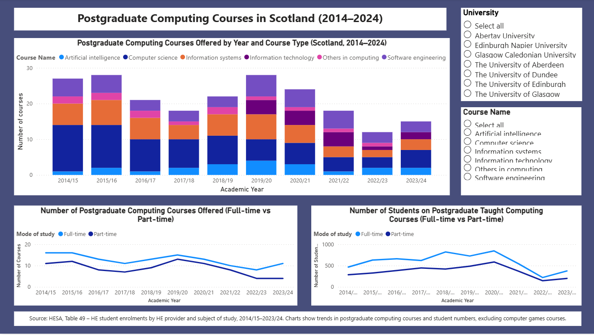

Postgraduate Computing Courses in Scotland (Power BI)

Power BI dashboard analysing postgraduate computing courses offered by Scottish universities between 2014 and 2024.

Includes:
- Stacked bar chart showing courses by year and course type
- Trend lines for number of courses and student enrolments (full-time vs part-time)
- Interactive slicers for university and course

- ## Dashboard Preview

Source: HESA Table 49.
Computer games courses are excluded.
