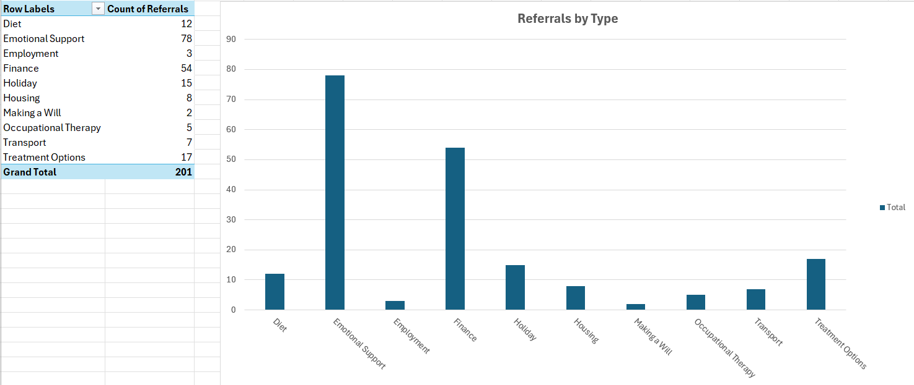
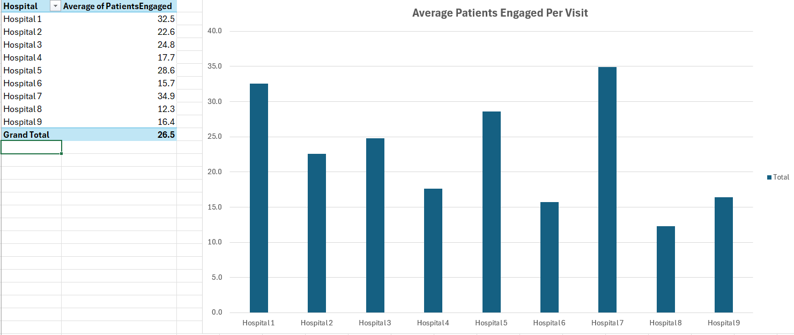

# Hospital Data Analysis (Excel)

This Excel workbook analyses hospital referral and patient engagement data.  
It shows how hospitals receive referrals, how referrals vary over time, and how many patients are engaged during visits. The dataset is synthetic and anonymised, but the workbook demonstrates real-world data analysis skills.

The workbook includes several sheets, each telling a part of the story:

- **ReferralsByType** – Shows how many referrals of each type were received. A pivot table summarises the counts, and a bar chart visualises the differences. This helps to understand which referral types are most common.  
- **ReferralsByMonthHospital** – Tracks the number of referrals each hospital receives each month. The clustered bar chart highlights seasonal trends or spikes in referrals over time.  
- **Average Patients Engaged per Visit** – Shows the average number of patients engaged per visit at each hospital. Pivot tables and charts make it easy to compare performance across hospitals.  
- **Additional sheets** – Include referral rates, notes about the data, and the underlying anonymised dataset.

**A selection of key outputs**

**Referrals by Type**

**Referrals by Month and Hospital**

**Average Patients Engaged per Visit**

