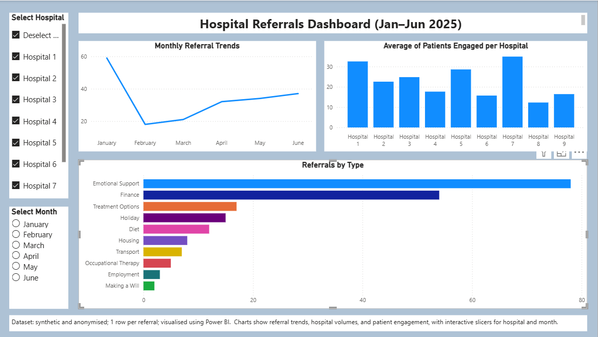

# Hospital Referrals Dashboard (Power BI)

This interactive Power BI dashboard visualises hospital referral and patient engagement data.  
The dataset is **synthetic and anonymised** — all numbers are made up so the dashboard can be publicly shared — but it reflects how real hospital data is structured.

The dashboard tells a clear story:

1. **Monthly Referral Trends (Jan–Jun 2025)**  
   Shows how the number of referrals changes over time. This helps identify busy periods and trends across hospitals.

2. **Average Patients Engaged per Hospital**  
   Displays the average number of patients engaged during visits at each hospital. This allows comparisons of engagement performance across hospitals.

3. **Referrals by Type**  
   Shows the number of referrals for each type at a selected hospital. Use the **hospital slicer** to choose which hospital’s data to display. Different referral types are shown as coloured bars.

---

### Explore the Data

Use the **hospital** and **month** slicers to filter the data dynamically. This makes it easy to focus on specific hospitals or time periods.

---

## Dashboard Preview

